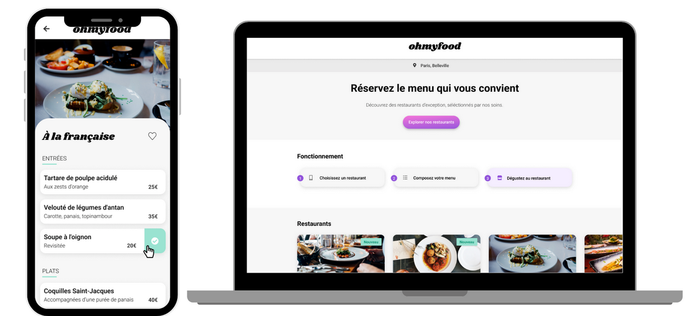

.

#  _Ohmyfood_
_Ohmyfood!_ est une entreprise qui perment aux clients de commander leus repas en ligne. 
Le client peut composer son propre menu dans le site ce qui lui perment d'éviter le temps d’attente dans les restaurants.

## Mission
 Développer le site de * _Ohmyfood_ en “mobile first” et ensuite pur tablette et desktop. 

	
## Les contraintes à respecter pour l'ingration 

### Graphiques:

#### Couleurs
* Primaire #9356DC
* Secondaire #FF79DA
* Tertiaire #99E2D0
 
#### Polices
* Texte: Roboto
* Logo et titre: _Shrikhand_

### Technologies
1. Utiliser CSS avec SASS(optionnel).
2. Le HTML ne pas contenir des balise <style>.

>Le site doit être accessible sur GitHub et il ne doit pas y'avoir ni du javascript ni des frameworks.

## Les differentes pages

### Accueil
### Menu des restaurants(x4)

## Animations

1. Loader dans la page d'accueil
2. Hover: ramplissage du coeur et Cheapparition du checkbox sur les menus
3. Apparition des menus d'une manière progressive

## Developpement
1. Utilisation de git et github
2. SASS
A) Mise en place de l'architecture 7:1, pour ce projet vous trouverez 
base: _normalize.scss
components: les buttons, les cartes, les gestions des formulaires(coeur, checkbox)
utils: les variables et les mixins
layouts:body, header et le footer,

B) Organisation du code
Découpage du projet par des petits bouts de code sur differents fichier.scss
* animations
* breakpoints
* loaders

